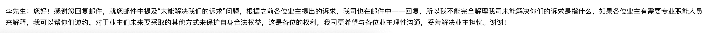

### 说明
本文为对贤林信步对金辉集团提出的诉求，及金辉集团代表的回复的解读。其中诉求原文请点击查看➡️ [贤信信步业主诉求](../闲林信步购房诉求第一版/1118诉求.md),金辉代表回复原文请点击查看➡️ [金辉代表回复原文](../贤林信步业主回复/1127回复.md)。

由于今天有业主被用**私人电话**拨打，并号称已经进去看过贤林信步装修状态（奇怪，为什么业主没法看）的闲林派出所的的警察叔叔叫去喝茶，被警告，并给了一些建设性的建议。所以本文尽量以保持中立的态度来阐述事实。

本文将依次根据诉求对回复内容做解读。另外需要说明的是，写这篇解读的原因是:

1. 2018年10月18日已联系销售要求公开装修明细；

2. 2018年11月17日向金辉客服总监吴女士以及一位刘姓同事当面沟通，提出了一些诉求，并通过邮件进行了知会，诉求内容参考➡️ [贤信信步业主诉求](../闲林信步购房诉求第一版/1118诉求.md)。

3. 应对方要求给足金辉代表7个工作日，但是回复的内容➡️ [金辉代表回复原文](../贤林信步业主回复/1127回复.md)对业主几乎是毫无作用的，且大部分内容与11月17号面谈过程中是重复的，可以说这7个工作日，金辉代表并没有做很多实质性工作，对业主诉求的态度在我看来是散漫的。面谈过程中有业主代表录音，后续如有需要可以**公开**。

### 解读
1. 关于毛坯开发日的问题。
   首先业主要求有一条是:

   > 必须开放一次⽑坯房开发日，两次精装房开放日

   回复的内容较长，不再粘贴，主要意思是：

   > 毛坯开放日暂时不方便

 这里有2点需要说明。

> 1：11月17日交流过程中，金辉代表表示，毛坯开发日需要2个月时间准备；
>
> 2：目前贤林信步楼盘已经大部分进入精装修步骤，不知是否还有毛坯房子留下。如果再以不具备对外开放条件为由拒绝业主对毛坯的状态的查看，可以说是剥夺了业主的知情权。

业主购买的房子，有知情权，提出毛坯开放日的要求并不过分，金辉代表的回复可以说是以各种理由推脱开放毛坯开发日。既然面谈时已经有业主提出疑虑，如果需要准备2个月，到时候是否还有毛坯状态的房子剩余，应当给以说明目前的施工进度是否支持2个月后仍然有毛坯状态的房子查看。

这样的回复不能让人满意，且回复与11月17日面谈时雷同。

2. 关于精装修材料清单的问题。

   首先需要看一下的是：**按照双方签订的《浙江省商品房买卖合同》第 22 ⻚ “第十四条 出卖人 关于装饰、设备标准承诺 的违约责任” “双方将该商品房的装饰、设备标 准约定于合同附件四，如为精装修房，双⽅应当 约定装修使⽤的主要材料和 设备的品牌、产地、规格、数量等内容。出卖⼈交付商品房，应当 符合约定 的装饰、设备标准。达不不到约定标准的，出卖⼈补偿装修、设备差价，并承 担违约责 任如下:赔偿⼀倍差价。** 而精装修清单是列在补充协议中的，首先现有补充协议并没有做到**约定装修使用的主要材料和设备的品牌、产地、规格、数量等内容** 。

   我们再来看下金辉11月27日恢复的清单内容：

   > 地面:(1)卧室、客餐厅:圣象实木复合地板; (2)厨卫、阳台:萨⽶特地砖; 
   >
   > ⻔窗:(1)进户门:“群升”钢质⻔配置密码锁; (2)户内门:“泰森日盛”门 
   >
   > 厨房:(1)燃气灶、油烟机:“⽅太”CXW-200-EG08; (2) 水槽、龙头:“摩恩”(GN70111型号); (3) 冷霸:“奥普”; (4)整体橱柜，⼈造石台⾯:大诚橱柜。 
   >
   > 卫生间:(1)台盆:“贝朗”(C22131W-A型号); (2)洗手盆龙头:“摩恩”(GN91121型号); (3)花洒龙头:“摩恩”(GC10234+顶喷2268型号); (4)淋浴屏:“朗斯”; 
   >
   > (5) 暖风机:“松下”(FV-27BG2C型号); (6) 坐便器:“贝朗”(C2167W-3A型号); (7) 整体镜柜:⼤诚橱柜; 
   >
   > 电梯:迅达;
   >  可视对讲:“狄耐克”品牌彩色可视对讲室内机⼀套; 开关、插座、小夜灯:罗格朗品牌; 空调系统:“美的”分体空调(室内为⻛管机)，室内客厅餐厅外机匹数为3匹， 房间为1.5匹;
   >  热⽔器:“美的”空气能热水器，容量为150升; 射灯、筒灯、灯带:雷士照明、欧普照明; 

   材料和 设备的品牌、产地、规格、数量等内容并没有全列出，依然没有符合主合同的标准。如果我们再回头看看业主诉求的要求:

   >1. 除第7条所列列要求外，补充下列要求 
   >2. 列出所有屋内精装修材料料、设备的清单，包括其他诉求中描述加入清单的材料、设备; 
   >3. 清单要求写明材料或设备的品牌、⽣产年⽉、产地、规格、数量和市场价格。 
   >4. 无法通过公共渠道(淘宝、京东电商渠道及官网渠道)查明设备、材料型号的，应当注明该材料、设备的功能归类(如空调属于中央空调还是风管机，热水器器是空⽓能热 ⽔器还是燃⽓热水器)以及备注可通过公共渠道查到的可类比的同等材料、设备，单 价格差别范围不得超过5% 
   >5. 所列材料、设备清单的价格需达到精装修标准，根据公摊⾯积是否属于精装修范围内 确定为:是则为3000元/平，否则为(3000*建筑⾯面积/套内⾯面积)元/平 

   发现对于业主的诉求也是无一满足。其中很多设备是没有提供型号的，比如所谓的圣象实木复合地板，不同型号，价格千差万别。更可笑的是金辉居然把 **电梯、入户门、公摊区域**装修都计算入了精装修内。这里让人不得不提出一个疑问，难道毛坯交付的房子就没有 **电梯、入户门和公摊区域的装修**了？？。

   关于精装修清单明细，及精装修范围，公摊面积如何处理，都没有一个明确的答复。

   这里还有两个点需要重点说明下：

    1. 根据金辉给出的设备清单，除去公摊面积，计算下材料费和设备费，是否能够达到(3000*建筑⾯面积/套内⾯面积)元/平？
    2. 金辉代表回复说，精装修是由备案过的，那么请问当时是如何备案的，对于精装修的定价备案总是需要有材料及设备清单的。那么当时备案的清单在哪里，如果是邮件中给出的清单，又是怎么通过的备案？

   根据金辉目前给出的明细，我们无法有效核算价格，只能根据已给出清单大致估算装修价格，参考[口水楼市](https://zzhzbbs.zjol.com.cn/thread-21521618-1-1.html)和[19楼](https://www.19lou.com/forum-269-thread-6931543329003656-1-1.html)的两篇其他业主发的帖子，远远达不到3000元/平的装修标准，希望金辉的工作人员看到后能给出符合合同要求的精装修明细。这里有几个关键点需要确定：

   1. 要求给出材料和设备的品牌、产地、规格、数量、价格数据，既然目前已经进入精装修步骤了，为什么无法给出？

   2. 诉求与面谈时已经提出要求，给出材料或设备的市场价格即可，为什么还要以与供应商之间的价格保护条款约定为由拒绝公布市场价格。

   3. 为什么电梯、入户门、公摊区域等毛坯房也需要交付的设备或区域也计算入精装修范围。

   回复结果，显然无法让人满意。

3. 关于补充合同中的霸王条款问题。

   霸王条款内容已在[贤信信步业主诉求](../闲林信步购房诉求第一版/1118诉求.md)中给出。从合同中可以看出：仅有在 房屋存在地基基础及主体结构质量经有权机构检测不合格的 才有权力拒绝收房，这难道不是说其他条件都不能拒绝收房吗？其中金辉代表回复意思是：<u>不能作为拒绝收房的理由，并未强制表示不能拒绝收房</u>。试问一下，我来对应的权力都没有了，还能行使对应的权力吗？这难道还不是赤裸裸的霸王条款吗？

   另外**第六条关于装饰、设备标准的补充约定**也是霸王条款，其中有2条，1：买受人在接收房屋时，对该商品房的装修、装饰及设备标准若有异议……买受人应按时办理该商品房交接手续，不能以此为由拒绝接收该商品房。 2： 在房屋装饰、设备、设施不达标，出卖人维修期间仅承担房屋整改责任，不承担其他责任。

   试问1：房屋装修不达标，却要求不能拒绝交房，这算不算霸王条款？ 2：既然在维修期间导致业主无法入住，是房屋质量引起的，为什么不承担由此给业主带来的其他损失？这是不是霸王条款？

   回复结果无法让人满意。

4. 关于车位费及特约服务费的问题。

   首先说明一点，特约服务费是业主当时签合同时强制要求签的，如果业主不签，那么就拒绝你签后面的合同。
   另外，关于金辉楼盘特约服务费一事，南京那边已有先例，大家可以查看➡️[物业公司为何收取"特殊服务费"](http://hn.house.qq.com/a/20161126/009681.htm) ,同样是金辉的楼盘，已被叫停，且在11月17日面谈时向金辉客服代表提及过此楼盘的情况。
   看金辉代表此次的回复，具体查看➡️[金辉代表回复原文](../贤林信步业主回复/1127回复.md) ，基本都是在口头承诺一些事项，也没有参照南京楼盘的操作。
   关于车位费，不知道闲林信步这个地段的车位管理费是怎么做到80元/月的。可以说比主城区的楼盘还要高，比周围的楼盘也要高，参考雅居乐 60元/月。
   回复无法让人满意。

5. 其他诉求问题。
   时间有限，其他诉求条目暂不解读。

### 结语

1. 应金辉代表要求，给足7天时间处理业主诉求，结果给到的回复是同面谈时大量雷同的，这可能就是金辉对于业主诉求的办事效率吧。
2. 对于业主的诉求回复，居然是没有带公章的，不知道金辉代表这样回复的邮件是否有足够的权威性。
3. 我不过渡评判金辉的办事效率、方式及合理性。就本次交流而言，或许金辉的办事方式就是这样子的。
4. 由于通过面谈和邮件沟通的方式效率太低，金辉方一直无法对关键诉求给出正面回应，我们已决定后续不再通过邮件的形式与金辉方沟通。
5. 希望后续政府部门能够介入，共同协商，合理的解决问题。
6. 希望该开发商接下去的楼盘不要出现类似拿不出精装修清单，给不出开放日，办事效率低下等情况，买到房子的业主们能顺顺利利

另外附上11月28日金辉方收到我方表示后续不再通过邮件沟通后的回复：

邮件中有提到一句：我不能完全理解我司未能解决你们的诉求是指什么。

在此我们想说一句话：我们不能完全理解你为什么不能完全理解我司未能解决你们的诉求是指什么。