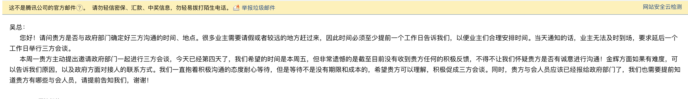

## 邮件催促

由于本来约定本周进行的三方会谈,金辉方迟迟不给时间回复，于是业主主动发邮件催促方法会谈的进行。

在周五时未接收到金辉方面的回复，50多名业主自发前往临平信访局对金辉·贤林信步就精装修明细等一系列问题进行上访，现将信访内容记录如下。

## 信访记录

由于根据信访规则，同一时间至多接待5名上访者，所以本次与会业主人员限制在了5名。

### 与会人员

**信访局接访科代表、余杭区市场监督管理局代表、物价局代表、房产管理处代表、闲林街道住建科代表、法律顾问代表、金辉客服代表、贤林信步业主代表**。

### 成果

1. 要求金辉方下周五按照现行法律法规和合同要求，**重新公布精装修明细清单并盖章**。
2. 要求闲林售楼处开放，并张贴最新的精装修明细清单，并标注公示截止日期。
3. 要求公示毛坯验收文件。
4. 我们签订的《补充协议》**未备案**，且中间有数条业主们认为是霸王条款的约定。我们要求金辉方10日内去市场监督管理局备案，市场监督管理局审核时间不定。
5. 开发商明确答应会有**一次精装修开放日**，时间未定；**毛坯开放日直接拒绝**，我们没找到相应的法律去要求开放，实在抱歉。
6. 《前期服务协议》已经备案过，《特约服务协议》没有备案，房管处也不要求备案。

#### 业主注意事项

1. 《补充协议》的法律效应是可以**覆盖主合同**的。即如果《补充协议》与主合同出现矛盾点，除特别说明外以《补充协议》为准。如果《补充协议》确实存在“霸王条款”，则会以《补充协议》中约定的为主，对后续收房有较大影响，如果《补充协议》不存在“霸王条款”，则对于业主们是万事大吉。
2. 我们要求备案《补充协议》，如果新备案通过的《补充协议》与我们现签订的《补充协议》前后不一致，后续如何处理，市场监督管理局的代表并**未正面回答，各位业主可自行电话联系市场监督管理局咨询**，如果出现上述情况，该做如何处理。
3. 对《补充协议》上述处理结果不满意的，可以继续通过[政府渠道](../政府渠道/政府渠道联系方式.md)进行投诉。

### 政府各部门的观点

#### 一致观点

1. 既然签订了合同，就以合同为准执行，要讲究契约精神。
2. 认为合同签订不合规，合同内容不合理的建议走司法途径。

#### 部门观点

##### 市场监督管理局

1. 市场监督管理局对《补充协议》、《特约服务协议》、《前期物业协议》**备案无要求**，只是建议备案。（需要进一步查证）
2. 市场监督管理局对新通过备案的《补充协议》与已签订的《补充协议》出现不一致的情况的处理方案**无明确答复**。

##### 物价局

1. 开发备案精装修价格，仅仅备案精装修价格，**物价局不审查精装修内容**。
2. 物价局不负责开发商清单中装修材料或设备具体的价格是否合理，例如：某个空调市场价2000元，如果开发商列明价格是1万元，物价局不会对其进行监管和处罚。即**物价局不监管标价是否远超市场价的情况。（需要进一步去查证，不明白青岛大虾事件又是怎么解决的）**

##### 政府的法律顾问

1. 在看过《补充协议》后，提出如果后续不得已走司法途径，其中不合理的可以认定无效。但是**没有指出哪些可以认定无效**。

### 其他信息

1. 开发商客服代表吴女士明确告知售楼处的**样板房即将拆除**，按开发商的口径是临时样板房，并不是实体样板房。可能影响后续业主收房时的比对检查。但是事后根据我们查阅《中华人民共和国消费者权益保护法》规定：**房地产经营者预售全装修商品房的，应当提供交付样板房。交付样板房的保留时间，自全装修商品房交付消费者之日起不少于六个月，或者自建设项目竣工验收合格之日起不少于两年。全装修商品房的展示样板房、模型、展示板以及广告对于合同订立有重大影响的，应当作为房屋装修质量的交付标准。** 拆除样板房，比如是违反了《中华人民共和国消费者权益保护法》，各位可以通过合理合法的途径进行投诉。
2. 合同签订过程中是否合法合规，各位业主可以去搜集相应证据。比如：签订合同前是否有公示合同、是否存在未看过合同，选房却要求交定金，交付了定金不可退（**即未看过合同是否合理，先交付了不可退款的定金**）的情况、《补充协议》与主合同一起签订诱导《补充协议》是主合同一部分等情况。

