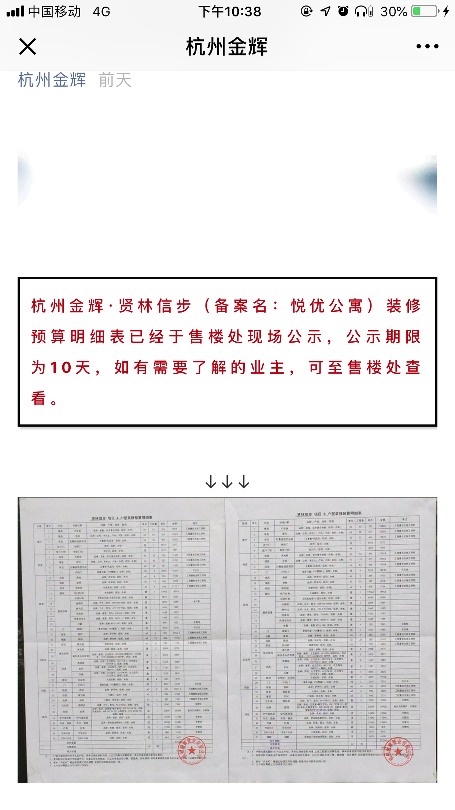
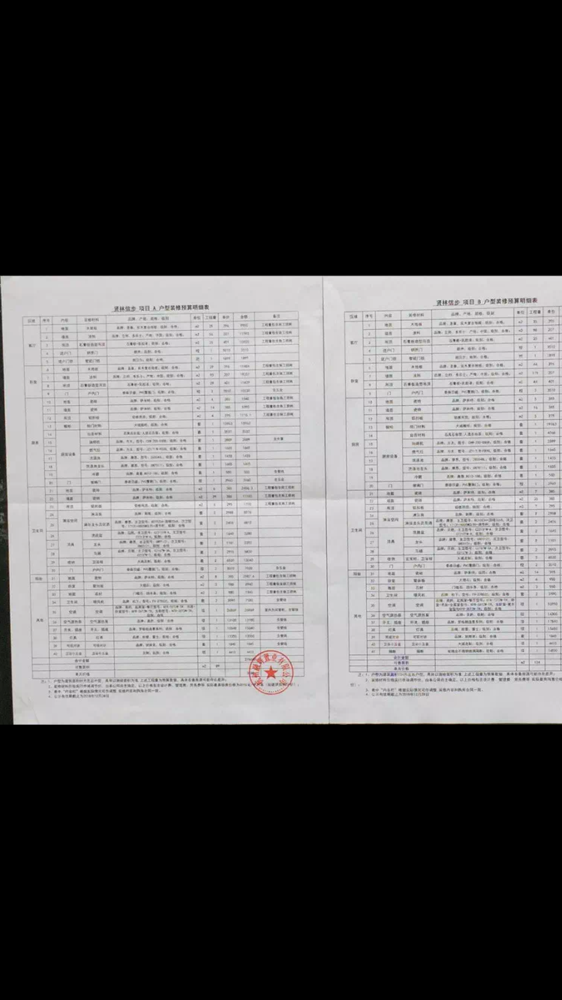
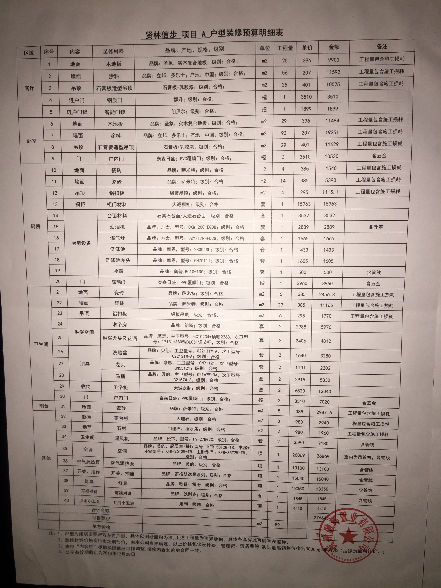
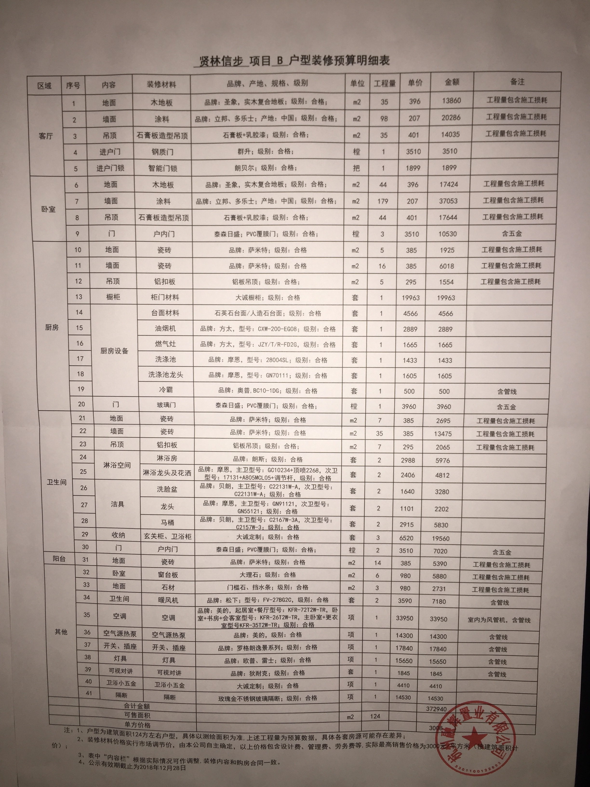

2018年12月14日星期五，今天有业主说接到政府电话，说金辉方面公布了贤林信步楼盘的精装修明细。但是我们通过“杭州金辉”公众号，无法查看到精装修明细。初步认为金辉方将精装修明细贴在了售楼部，但是没有在公众号平台发布。在拨打金辉客服代表吴女士电话后确认，**仅在售楼处**贴出了精装修明细。

2018年12月14日星期五晚上6.53左右，有业主发现“杭州金辉”公众号发布了电子版清单。[杭州金辉·贤林信步（备案名：悦优公寓）项目装修预算明细表](https://mp.weixin.qq.com/s/XjSaZlgNsvcZSos2tSZpdA) 。就这清晰度，当时业主群里有很多业主忍不住发了脏话，我不知道是金辉方面工作失误，还是态度上的问题，导致了这么模糊的图片公示出来，完全不是一家大开发商该做的事。公众号上公布清单截图如下（**已经是手机放大截图**）：

即使放大了，也完全看不清清单内容。

2018年12月14日晚上7.42，有业主前往贤林信步售楼部，从售楼部拍摄了张贴的精装修清单。

从现场公示的清单来看，依然存在但不仅限以下几个问题：1.部分材料或设备 依然与要求约定的 **主要材料和 设备的品牌、产地、规格、级别、数量等** 不符，也与表格要求不符。2. 本次公示的清单内容与[上次公示的清单](https://mp.weixin.qq.com/s/NtJuyjGVscE-1hwBIT9vZA)内容几乎无变更，却依然花费了5个工作日（7个自然日）的时间，办事效率很低。

业主们表示对该清单不认同，因为清单内容不符合规定。将会通过市场监管局及邮件的形式告知，对本次清单的不认可。